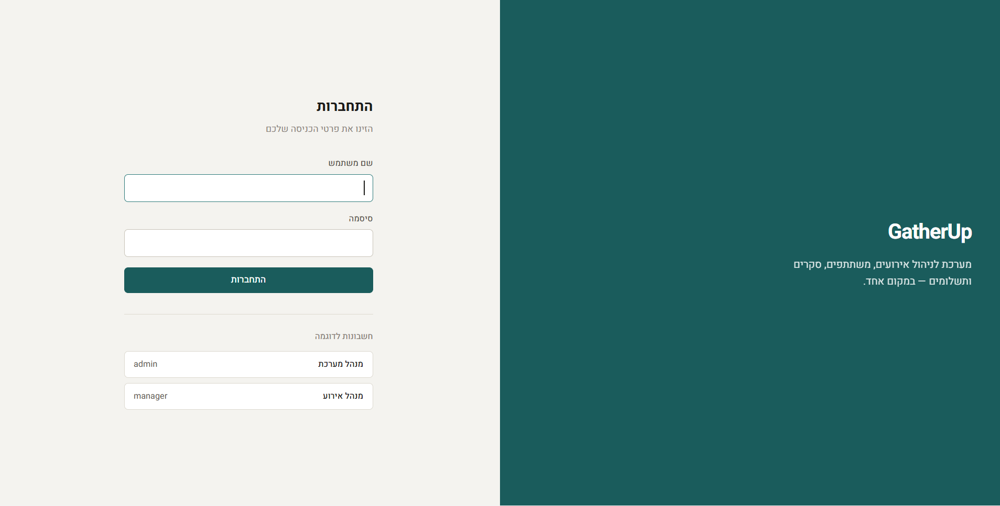
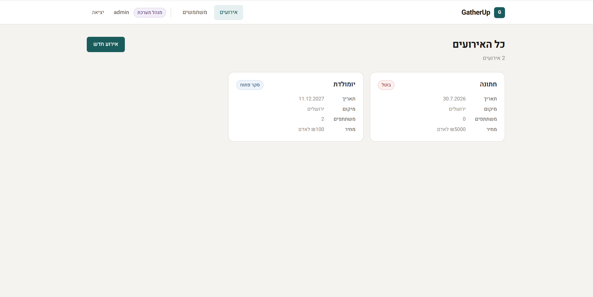
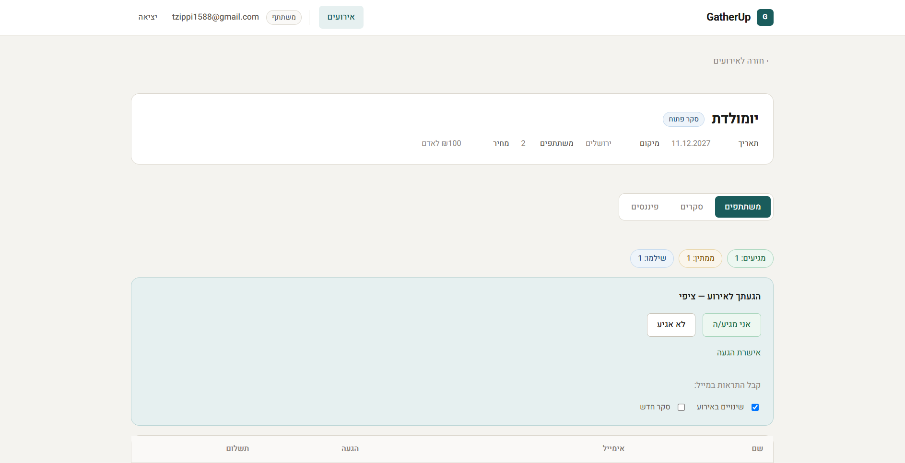
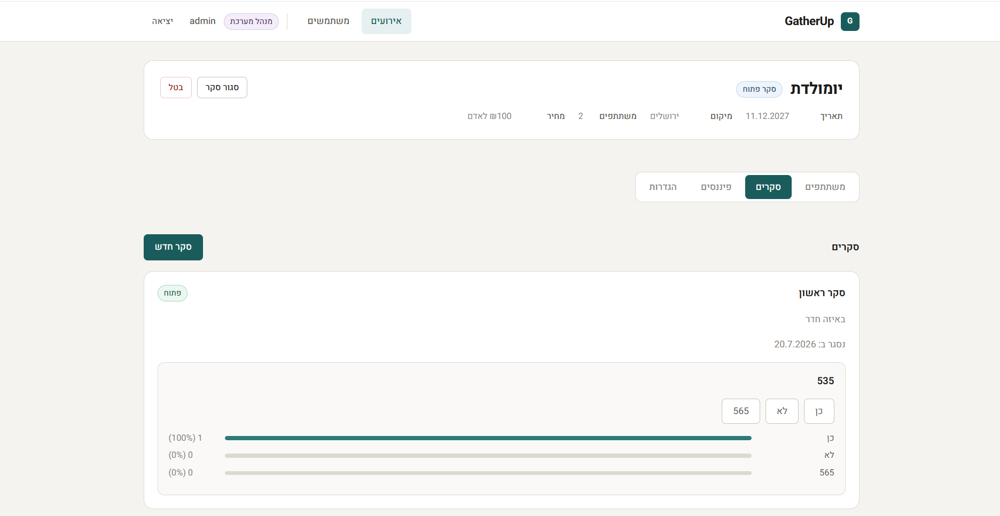

# GatherUp — Event Management System

A full-featured event management system with a user interface, API, participant management, polls, and financials.

---

## Screenshots

### Login


### Manager Dashboard


### User Dashboard


### Polls — Manager View


### Finance — Manager View


---

## Tech Stack

**Backend**
- .NET 8 — Web API
- JWT Authentication
- XML-based persistence (no database)
- BCrypt for password hashing
- SMTP for email sending

**Frontend**
- React 19 + TypeScript
- Vite
- React Router v7

---

## Project Structure

```
event-management-system/
├── GatherUp.API/            # Web API layer — Controllers, Middleware
├── GatherUp.BL/             # Business logic layer — Services
├── GatherUp.Core/           # Models, Interfaces, Enums, Exceptions
├── GatherUp.Infrastructure/ # Repositories, XML, Email
├── GatherUp.Client/         # React Frontend
└── GatherUp.Tests/          # Tests
```

---

## Running Locally

### Prerequisites
- [.NET 8 SDK](https://dotnet.microsoft.com/download)
- [Node.js 18+](https://nodejs.org/)

### 1. Configure appsettings

In the `GatherUp.API` folder, create an `appsettings.json` based on `appsettings.Example.json`:

```json
{
  "Jwt": {
    "Key": "YOUR_SECRET_KEY_MIN_32_CHARS"
  },
  "Email": {
    "From": "your-email@example.com",
    "Password": "your-smtp-password",
    "Host": "smtp.example.com",
    "Port": "587"
  }
}
```

> If Email is not configured — the system will run without sending emails.

### 2. Start the server

```bash
cd event-management-system/GatherUp.API
dotnet run
```

Server runs at: `http://localhost:5000`  
Swagger UI available at: `http://localhost:5000/swagger`

### 3. Start the client

```bash
cd event-management-system/GatherUp.Client
npm install
npm run dev
```

Client runs at: `http://localhost:5173`

---

## Default Users

| Username | Password    | Role           |
|----------|-------------|----------------|
| admin    | admin123    | System Admin   |
| manager  | manager123  | Event Manager  |

---

## Key Features

- **Event Management** — Create, edit, change status (Draft → Active → Completed)
- **Participants** — Add participants, RSVP (confirm/decline attendance), manage notifications
- **Polls** — Create polls with questions, voting, and results
- **Financials** — Track payments, vendors, and receipts
- **Invitations** — Send email invitations to participants
- **Authorization** — Admin / Manager / Participant roles with protected endpoints
